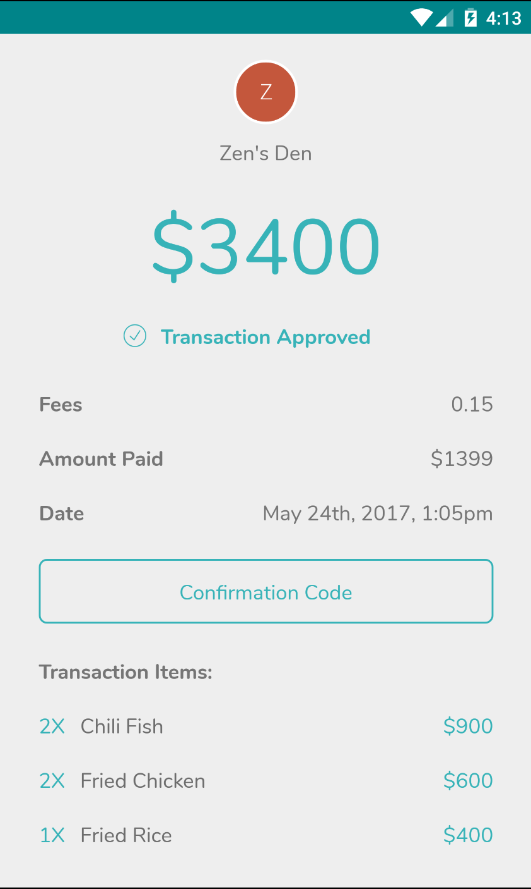
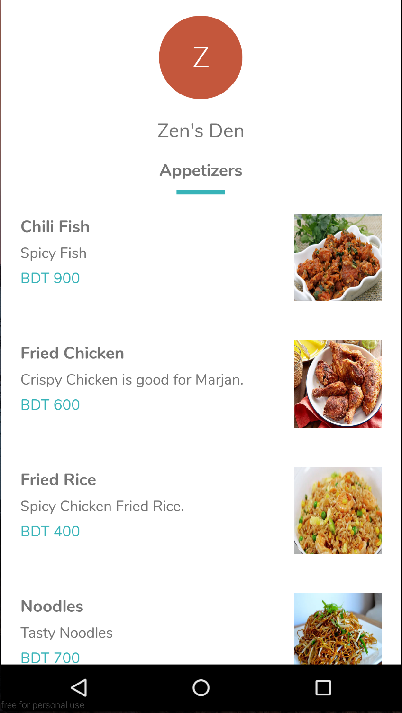
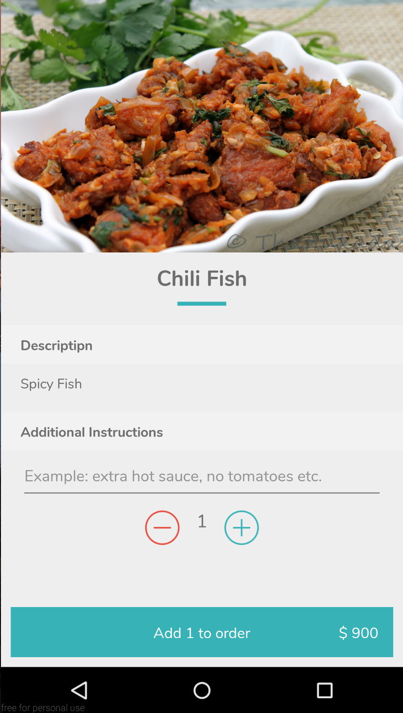

# Koin
QR Code based Mobile Wallet

### Features

* Scan credit/debit card to link bank account
* Scan QR Code to make payments
* Payments authorized by fingerprint/4-digit pin 
* Types of payment flows:
   * Static Qr codes - scan the paper based "static" Qr code and enter the amount you wish to pay
   * Dynamic Qr codes - scan the Qr from the merchant application and hit "Pay"
   * Inventory Qr codes - scan the Qr code, select from a range of items on the menu and hit "Pay"

### Screenshots
  
  

     
  

  

### Models
[Protocol Buffers](https://github.com/google/protobuf) is an interface definition language that is used here to represent the models and Data Transfer Objects (DTO). This makes the DTOs platform independent with minimal boilerplate code.

### Dependencies

[Dagger](https://github.com/google/dagger) is used for dependency injection. Some advantages: 
 -  Allows us to achieve inversion-of-control.
 -  Allows us to swap out dependencies easily for testing.
 -  Allows us to control the scope and lifetime of these dependencies.

### Network Calls

[Retrofit](https://github.com/square/retrofit) is the http client client used in this application. Some advantages:
 - Allows seperation of concerns as the implementation is based on designing interfaces.
 - Allows us to produce fake implementations of the interface when testing and make the tests independent of network requests. 
 - Supports RxJava very well as the interface methods are allowed to return Observables.

### Asynchronous Framework

[RxJava](https://github.com/ReactiveX/RxJava) is the framework used to simplify asynchronous programming. Based on the nature of this app which requires us to fetch a list of objects and perform filter-map-reduce operations RxJava and a functional approach seemed appropriate. Some advantages:

- Allows us to simplify the ability to chain async operations and avoid layered callbacks.
- Allows good error handling as errors from these chained async operations are caught in one place.
- Allows us to avoid keeping track of state variables and associated bugs as we are thinking about how data flows and modifying the streams of data using a functional approach.

### Testing

[Mockito](https://github.com/mockito/mockito) and [Robolectric](https://github.com/robolectric/robolectric) are used to help test the application. Some advantages:

- Mockito allows us to easily mock the contracts between the views and presenters and validate the data
passed through the contract methods.
- Robolectric allows us to detach the Android SDK jar from the app so that the tests can be 
run on a regular JVM. to facilitate network calls
